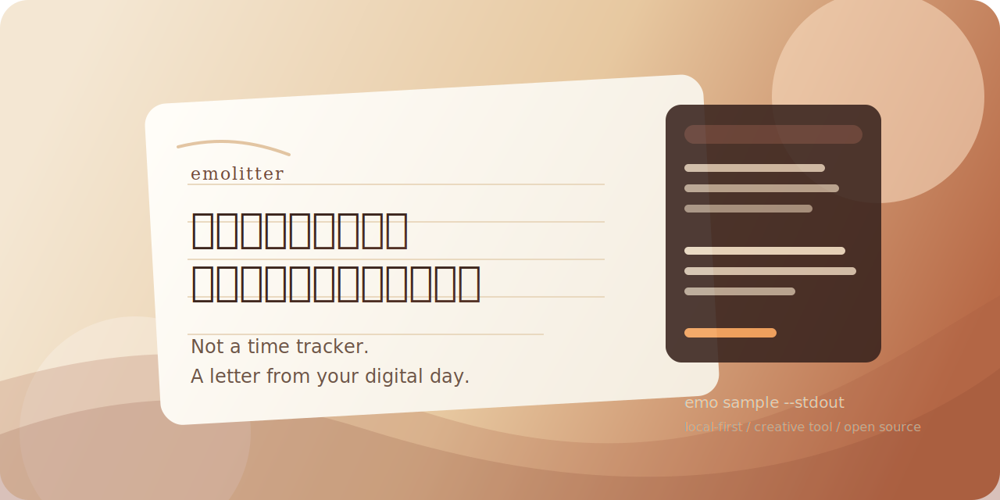

# emolitter



`emolitter` 是一个 local-first 的创意命令行工具。

它会把你在电脑前的一段日常动作, 整理成一封真正能读下去的信:
不是效率报表, 不是时间追踪图, 而是一份带情绪、带停顿、带叙述感的桌面来信。

现在它已经不只是一个命令行玩具, 而是一个更完整的中文创意工具:

- 直接输入 `emo` 就能进入中文菜单
- 支持默认配置保存
- 支持收信对象类型、风格、篇幅细分
- 支持历史记录、隐私说明、清理命令
- 支持 HTML 展示页和展示素材包导出

## 一句话理解它

把你一天的桌面日常, 写成一封真正能读下去的信。

不是 time tracker, 更像一封来自数字生活的来信。

## 先看样张

### gentle / 创作者的一天

> 从上午开始，我铺开了一张看不见的信纸，决定把今天写给未来的我。
>
> 随后，我踏入了「Visual Studio Code｜README.md」的领地，像给情绪换了一盏台灯。
>
> 接着，我轻轻敲下「r」，仿佛在替沉默添一笔旁白。

完整样张见 [examples/gentle-maker.txt](./examples/gentle-maker.txt)

### cinematic / 深夜项目

> 夜里像是缓慢拉开的第一幕，我铺开了一张看不见的信纸，决定把今天写给小王。
>
> 紧接着，我踏入了「Terminal｜npm run build」的领地，像给情绪换了一盏台灯。
>
> 所以今天真正值得记住的，不是我点开了什么、切走了什么，而是这些寻常动作最后竟也拼出了一点情绪的轮廓。

完整样张见 [examples/cinematic-midnight.txt](./examples/cinematic-midnight.txt)

### minimal / 普通工作日

> 你好，你。我从 2026 年 3 月 13 日 10:00 之后的这些桌面片段里，挑了几句最值得留下的话写给你。
>
> 我删掉了重复和噪音，只留下比较像句子的部分。

完整样张见 [examples/minimal-office.txt](./examples/minimal-office.txt)

## 最推荐的使用方式

### 1. 直接进入中文菜单

```bash
emo
```

适合第一次使用。

菜单里可以直接完成：

- 开始记录今天
- 结束记录并生成书信
- 生成演示样张
- 导出展示素材包
- 修改默认设置
- 查看历史记录
- 查看隐私说明
- 清理数据

### 2. 一条命令快速开始

```bash
emo open --to "未来的我" --kind future --voice gentle --length standard
```

结束并生成：

```bash
emo close --stdout
```

如果你还想同时导出 HTML 展示页：

```bash
emo close --html --stdout
```

### 3. 不开监听, 先看效果

```bash
emo sample --to "小王" --kind someone --voice cinematic --length long --theme midnight --stdout --html
```

### 4. 一键导出展示素材包

```bash
emo showcase --to "未来的我" --kind future --length standard --theme maker
```

它会生成：

- 3 封不同 voice 的样张信
- 3 个 HTML 展示页
- 1 个 index.html 总览页
- README 可引用摘录
- 封面标题候选
- 社交发帖文案

## 功能一览

- `emo` 中文菜单主入口
- `emo open` 启动后台监听
- `emo close` 结束记录并生成书信
- `emo status` 查看当前记录状态
- `emo history` 查看最近生成记录
- `emo sample` 直接生成演示样张
- `emo showcase` 一键导出展示素材包
- `emo settings` 查看或重置默认设置
- `emo privacy` 查看隐私说明
- `emo clear` 清理运行时数据、历史记录或默认配置

## 命令说明

### `emo`

进入中文菜单。

```bash
emo
```

### `emo open`

启动后台监听。

```bash
emo open [--to 收信人] [--kind someone|self|future] [--voice gentle|cinematic|minimal] [--length short|standard|long] [--html] [--outdir 目录]
```

### `emo close`

停止监听并生成书信。

```bash
emo close [--stdout] [--html]
```

### `emo status`

查看当前记录状态。

```bash
emo status
```

### `emo history`

查看最近生成的书信记录。

```bash
emo history [--limit 数量]
```

### `emo sample`

直接生成一封演示样张, 适合做截图、录屏、展示 README 或社交媒体内容。

```bash
emo sample [--to 收信人] [--kind someone|self|future] [--voice gentle|cinematic|minimal] [--length short|standard|long] [--theme maker|office|midnight] [--stdout] [--html]
```

### `emo showcase`

一次性导出适合 GitHub 首页、截图、发帖和录 GIF 的展示包。

```bash
emo showcase [--to 收信人] [--kind someone|self|future] [--length short|standard|long] [--theme maker|office|midnight] [--dir 输出目录]
```

### `emo settings`

查看当前默认配置, 或恢复为初始值。

```bash
emo settings
emo settings --reset
```

### `emo privacy`

查看隐私说明与本地文件位置。

```bash
emo privacy
```

### `emo clear`

清理运行时数据、历史或配置。

```bash
emo clear
emo clear --history
emo clear --config
emo clear --all
```

## 默认配置保存

`emolitter` 会把默认设置保存在本机：

- 默认收信人
- 默认收信对象类型
- 默认风格
- 默认篇幅
- 默认样张主题
- 默认输出目录
- 是否默认导出 HTML

配置文件位置：

```text
~/.emolitter/config.json
```

## 收信对象类型

### `someone`

写给某个人。更像一封真正寄给他人的信。

### `self`

写给自己。更像日记或回信。

### `future`

写给未来。更像数字时刻胶囊。

## 书信风格

### `gentle`

默认风格。更柔和, 更像日常来信。

### `cinematic`

更适合展示和传播。镜头感更强, 适合深夜项目和短视频文案。

### `minimal`

更克制, 更像简短但有质感的数字日记。

## 篇幅

### `short`

短笺。更轻, 更快, 适合做分享摘录。

### `standard`

标准。平衡可读性和完整性。

### `long`

长信。会保留更多片段, 更适合沉浸式阅读。

## HTML 展示页

`emolitter` 现在可以把书信导出成更适合展示和截图的 HTML 页面。

适用场景：

- 给朋友分享
- 做 GitHub README 演示
- 做录屏素材
- 做社媒截图

可以通过以下方式导出：

```bash
emo close --html
emo sample --html
emo showcase
```

## 历史记录与输出目录

- 历史记录保存在 `~/.emolitter/history.jsonl`
- 默认输出目录可以通过菜单设置为桌面或任意自定义路径
- `emo history` 可以快速查看最近生成的书信摘要

## 隐私说明

这是一个 local-first 工具：

- 监听与生成都在本机完成
- 结果默认写到你的本地目录
- 运行时状态写在 `~/.emolitter`
- 当前版本不会主动上传内容到云端

即便如此, 你仍然应该只在自己信任的环境里使用它。

## 演示素材

如果你想把它当成开源作品、个人品牌项目或短视频素材来展示, 可以直接复用：

- 演示截图脚本和首页标题建议: [docs/SHOWCASE.md](./docs/SHOWCASE.md)
- 社交文案与发布用语: [docs/LAUNCH_POSTS.md](./docs/LAUNCH_POSTS.md)
- 视觉系统与封面素材: [docs/VISUALS.md](./docs/VISUALS.md)
- 首屏 GIF 脚本: [docs/GIF_SCRIPT.md](./docs/GIF_SCRIPT.md)
- 创作者主题样张: [examples/gentle-maker.txt](./examples/gentle-maker.txt)
- 深夜项目主题样张: [examples/cinematic-midnight.txt](./examples/cinematic-midnight.txt)
- 克制风格样张: [examples/minimal-office.txt](./examples/minimal-office.txt)

## 安装

本地开发：

```bash
npm install
npm install -g .
```

从 npm 安装：

```bash
npm install -g emolitter
```

## 开发

查看帮助：

```bash
npm run check
```

快速打开菜单：

```bash
npm run menu
```

快速生成一个样张：

```bash
npm run sample
```

快速导出展示包：

```bash
npm run showcase
```

本地打包：

```bash
npm pack
```

## 为什么做它

我不太想再做一个“告诉你今天有多高效”的工具。

我更想做一个能把普通数字生活重新写得像作品的东西：
让窗口切换、键盘敲击、犹豫、停顿和深夜里的小动作, 都有机会被整理成一封信。

如果它刚好让你觉得：

- “今天也许并不值得统计, 但值得写下来”
- “原来普通的电脑日常也能有一点文学感”
- “这不像产品需求, 更像一个人做给世界看的作品”

那它就已经有价值了。

## License

MIT
